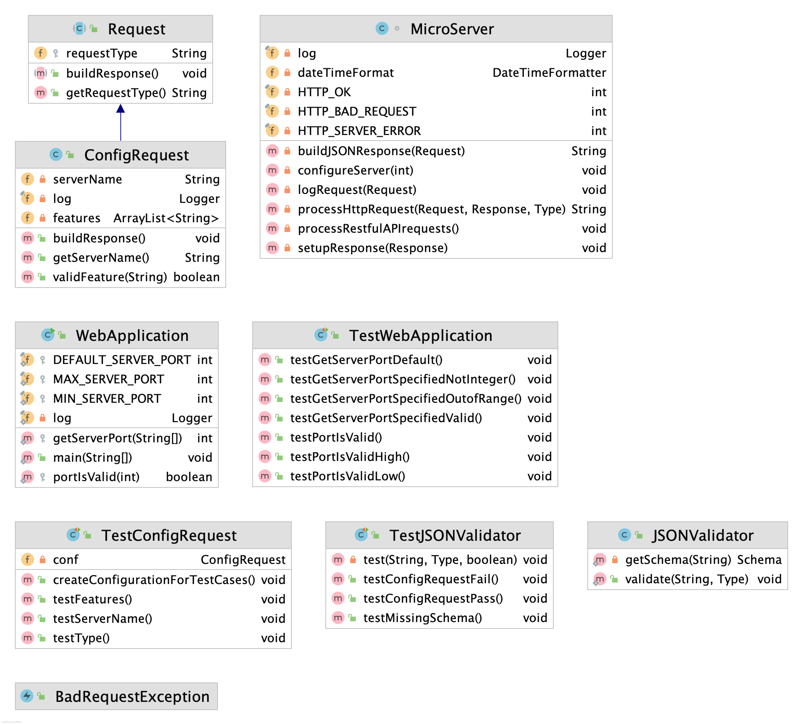
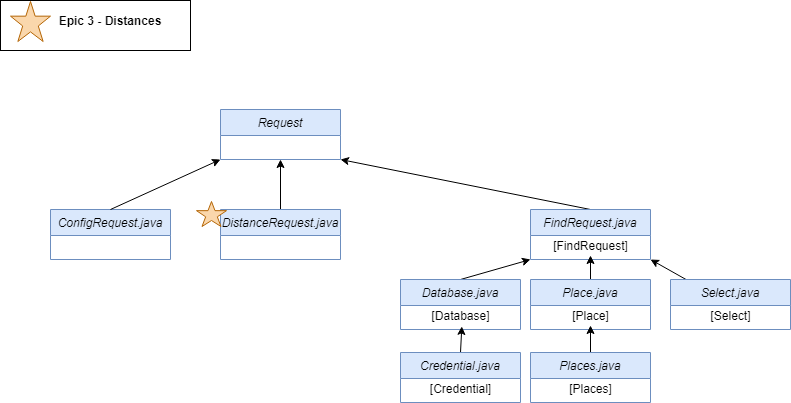

# Introduction

This document describes the architecture and design of a single page web application that interacts with microservices via RESTful APIs.
The key elements in this document include the architecture, user interface, client components, and server classes.

This is a living document that is updated as changes are made each sprint.
The initial document describes the Base code students are given as a starting point for the semester.
Students are expected to update this document as changes are made each sprint to reflect the evolution of their application and key decisions they make.
The Base section serves as an example.

# Base

The Base is a simple application to provide the architecture to the students at the beginning of the semester.
The JavaScript code will be useful examples for students to learn from and leverage in the code they write for sprint 1.
The progressive display of information using collapsible sections and popups will serve as examples of good user interface design.
The overall design is somewhat minimalist/simple for the intended mobile device audience.

### Architecture

The Base architecture is a JavaScript single page web application in an HTML5 browser that uses RESTful APIs to access Micro-services provided by a Java server running on Linux.
The client consists of a minimal index.html file that loads and executes the bundled JavaScript application.
The client and server files are bundled into a single JAR file for execution on the Linux server at a specified port.
The browser fetches the client files from the server on the specified port.

The browser loads the index.html file (by default) which in turn loads the bundled JavaScript single page application bundle.js.
* The single page application makes RESTful API requests to the server on the same port using  JavaScript's asynchronous fetch.  
* A protocol document describes the JSON format for the RESTful API requests and responses.
* JSON Schemas are used to verify requests on the server side and responses on the client side.
* On the client, ReactJS renders the application using ReactStrap, Leaflet, and application defined components.
* GSON is used on the server to convert JSON requests to Java objects and Java objects to JSON responses.
* The client (ulog) and server (SLF4J) logging mechanisms control debugging output during development and production - print statements and console logging should never be used. 

The following architecture elements are not included in the Base system.
They will be added later in the semester.
* Client filesystem.
* Server SQL.
* Server concurrency.

### User Interface

The basic screen in black shows the view on a mobile device, with a header, footer, and trip.
The header contains a earth logo and the team name obtained from the server when the client was loaded.
The footer contains a connection icon along with the current server name and server URL the client is connected to.
The trip shows a map and the current list of destinations.

Rather than buttons or icons to signify actions, we are associating actions with elements that are already on the screen to reduce the clutter.
We are using both popups and collapsible sections in this design rather than choosing to use one exclusively.
* Collapsible/Hidden sections are used for the map and about sections since they have a significant amount of content and we don't need to see them at the same time.
* A popup is used for the URL change since we want to control the interaction until the operation is completed. It seemed more natural than another collapsible section.

#### Clicking on the team name in the header displays an empty about screen.
Clicking again restores the trip screen.
We will fill this in later.

#### Clicking on the map adds to the trip.
Whenever a user clicks on the map, the client should display a marker with latitude, longitude, and a description at that location.
The description is obtained from reverse geocoding.
The location information is also added to the trip list below the map.
We only maintain a single marker at this point displaying the most recently clicked location.

#### Clicking the hamburgers (&#8942;) displays a menu of options.
At the trip level you can add the home (CSU Oval) location or clear the list.
At the destination level you can remove that destination from the list.

#### Clicking on the URL in the footer should let me change the server.
Whenever a user clicks on the URL a popup should open showing the team name, the URL in an input text box, and a Cancel button.
When the user modifies the URL, the client will attempt to connect to the new server and update the configuration.
When the Test button is clicked, it will attempt to connect to the server.
If not successful, nothing changes and the user may continue to make URL changes or click the Cancel button to return to the original sever (it shouldn't change).
If successful, the new server name should appear and a Save button should replace the Test button.
When the user clicks the Save button, the server connection should change and the popup closes, revealing the new servername and URL in the footer.

### Component Hierarchy
The component hierarchy for the base application depicted below shows the our top level App component with four children components.
* App renders the major components on the screen.
* Header renders an icon and a team name in the top banner.
* Footer renders the current server connection in the bottom footer.
* Atlas renders a map.
* About renders information about the team.

We do not show the many ReactStrap components in this hierarchy, even though they will appear when you are debugging on the client.

### Class Diagram
The class diagram for the base application depicted below shows the basic structure of the web server application.

The classes in blue represent the classes specific to this application.  
* WebApplication processes command line parameters and creates MicroServer.
* MicroServer start a web server on the given port, configures the server for security, static files, and APIs for different types of requests, and processes the requests as they arrive.
* JSONValidator verifies a request is properly formatted before attempting to process it using JSON Schemas.
* ConfigRequest is a specific request that allows the server to respond with its configuration to allow interoperability between clients and servers. 
* Request defines the basic components of all requests.
* BadReqeustException allows us to distinguish bad requests from other types of exceptions that may occur.

These test classes provide automated tests for unit testing.
* TestWebApplication
* TestConfigRequest
* TestJSONValidator

# Sprint 1

### User Interface

In this sprint, we will focus on team information.
There are two primary parts:
* browser tab, header, and footer.
* about page which includes team and member information,

Whenever a user clicks the team name in the header, a collapsible section should appear under the header with information about the team.
The collapsible map should disappear so only the about or map are displayed.
A simple toggle in state should be able to control this rendering.
The about page should contain the team name as a heading. 

The team name in the browser tab, header and are simple changes to constants in the client and server.

### Client Components

We will add 3 new components to the base architecture on the client to support the about page.
* Team component will render the team information
* Person component will render the individual information for a team member
* AboutCard component will render the team/individual information in a consistent fashion.

The existing About component will be modified to control the layout of the Team and Person components on the page.

### Server Classes
There are no changes to the server class structure in this sprint.
Only minor changes to text constants are required.

# Sprint 2

### User Interface

This sprint will implement two new features as described and pictured below.

Whenever a user clicks the magnifying glass icon, a search bar should appear in the My Trip section.
Users will be able to enter a simple string and a list of places matching their string will appear.

Whenever a user clicks on the hamburger icon, they can click on the home icon to add their current
location to their trip. 

### Client Components

### Server Classes

# Sprint 3
### User Interface

This sprint will implement four new features as described and pictured below. This sprint will also add
additional functionality to the first feature from Sprint 2.

Epic 1 - Find Places
Whenever the user clicks the search button, a popup appears that allows users to search for places. When they
press search, it displays a list of matching places, and next to each place there is a button to add the places 
they searched for to their trip.

Epic 2 - Interoperability 
Whenever a user clicks the server url link at the bottom of the screen, a pop up should appear.
Users will be able to click on the url in the search bar and new pop up should offer a list of
available servers and what features it supports and an add button to switch the current server.

Epic 3 - Distances
The users itinerary list will include a column providing the miles between the legs in the trip.

Epic 4 - Load the Trip
The user can load their current trip by clicking on the hamburgers and a load icon will appear. 
Clicking on the icon will provide a pop up with the option to load their file.

Epic 5 - Save the Trip
The user can save their current trip by clicking on the hamburgers and then a floppy disk 
icon will appear next to other buttons. When the user clicks on the icon a pop up will 
ask if the user wants to save the their trip as a json or a csv.

### Client Components
We will add 2 new components to the Itinerary.js on the client to support the Distance epic.
* DistanceColumn will render the distances between each leg.
* SendDistanceRequest send a request to the server asking for the distance and pass back to DistanceColumn.

We will add 2 new components to the Actions.js on the client to support the Load and Save epic.
* Load will render a button to a popup that will allow the user to load their existing trip.
* Save will render a button to a popup that will allow the user save their trip.

### Server Classes

In this sprint, the only class we have planned to add currently is DistanceRequest.java. This class 
will calculate the distances between points in the itinerary and keep track of the total trip distance.

# Sprint 4 

### User Interface

Epic 1 - Trip Name

The user will be able to change the name of their trip by typing in the textbox where the current trip name is.
Once they are satisfied with the name, they can click a button to confirm it.

Epic 2 - Shorter Trip

The user will be able to optimize their trip which will minimize the total distance for their trip. This
feature will be accessible via a new button in the hamburger menu.

Epic 3 - User Experience

The user will have the opportunity to evaluate the current application design and suggest changes to be added 
to future implementation.

Epic 4 - Save the Trip

The user can save their current trip by clicking on the hamburgers and then a floppy disk 
icon will appear next to other buttons. When the user clicks on the icon a pop up will 
ask if the user wants to save the their trip as a json or a csv.

### Client Components
We will add 3 new components to the Actions.js on the client to support the Trip Name Epic, Save Trip Epic
and the Shorter Trip Epic.
* TripNameBox.js will render the input box where My Trip header is currently.
* Save will render a button to a popup that will allow the user save their trip.
* senTourRequest.js is a button that will reorganize trip for the shortest distance.
* tour.js will update the itinerary with the shorter trip.

In this sprint, we will add 6 additional files on the server side for to complete 
the Shorter Trip Epic. 
* The TourRequest.java will handle the client's request while calling NearestNeighbor.java 
     to calculate the shortest tour. 
* NearestNeighbor will utilize the three data structures unvisited, tour and shortDistances. 
* 2opt.java to improve the shortest trip calculation. 
* 3opt.java is another improvement algorithim that will be implemented if there is time.

# Sprint 5

This sprint will add improvements to the overall user experiences as well as implement two new features as described and pictured below.

#### Epic 1 - User Experience

The user will be able to hover over the save, load, and optimize trip buttons and see a brief description, Users can additionally 
access the 314 website and our about page through links at the bottom of the webpage to improve accessibility. 
Interop will also be clarified in function and purpose when clicking the URL at the bottom. The user will have the option to edit
their trip name via button instead. Lastly, the search results will provide an option for the user to show more places.

#### Epic 2 - Highlight Place

The user will be able to select a location in their itinerary, changing the table row's color. The user will 
be able to drag and drop table rows as well.

#### Epic 3 - Save Maps

The user will have the ability to save their trip as a KML or SVG file.

### User Interface

#### Client Components
We will make 5 new component improvements for the User Experience Epic.
* Header.js renders the change server button. 
* Footer.js renders additional links for the About page and CS 314 web page.
* Actions.js renders tooltips for the buttons.
* ResultsBox.js will provide a show more button for additional results.
* TripNameBox.js provides the user an edit button to change the name of their trip.

Additionally, we will add 2 new components to the Itinerary to support 
the Highlight Place Epic.
* TripTable.js will render clickable and drag and drop capabilities for the rows. 
* TableRow.js will highlight the row clicked and show where on the map with a marker.

Lastly, we will include additional file saving capabilites for Epic 3 Save Maps.
* Save.js will allow the user to save their trip as a KML file.
* saveSVG.js will allow the user to save their map as an SVG image.

#### Server Classes
No changes will be made to the server classes for this sprint.

